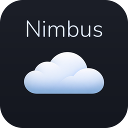
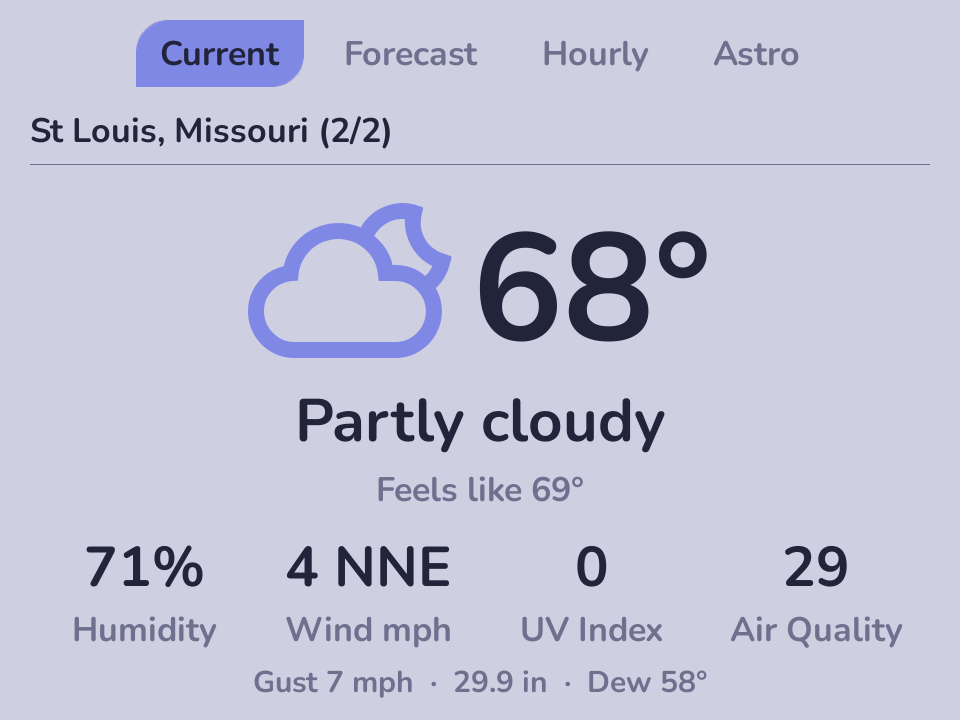
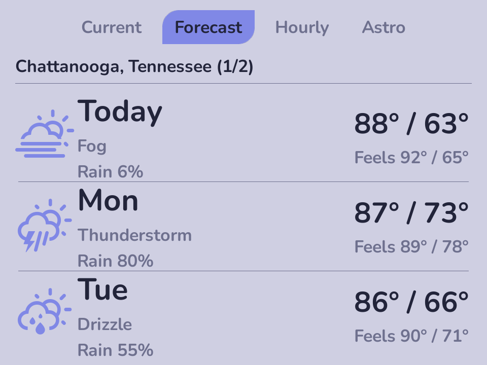
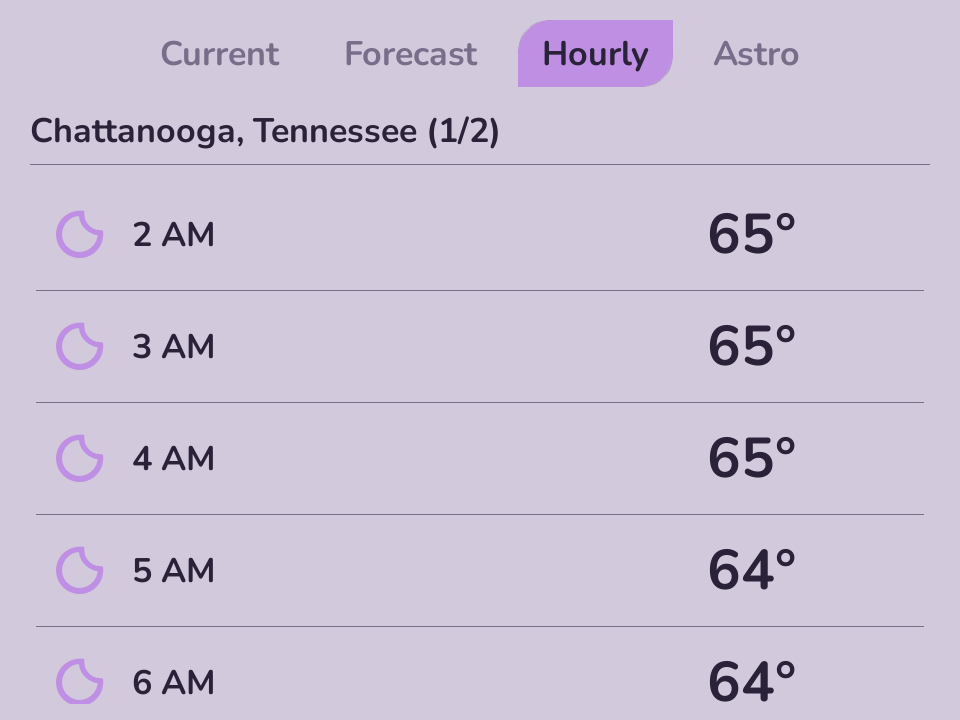
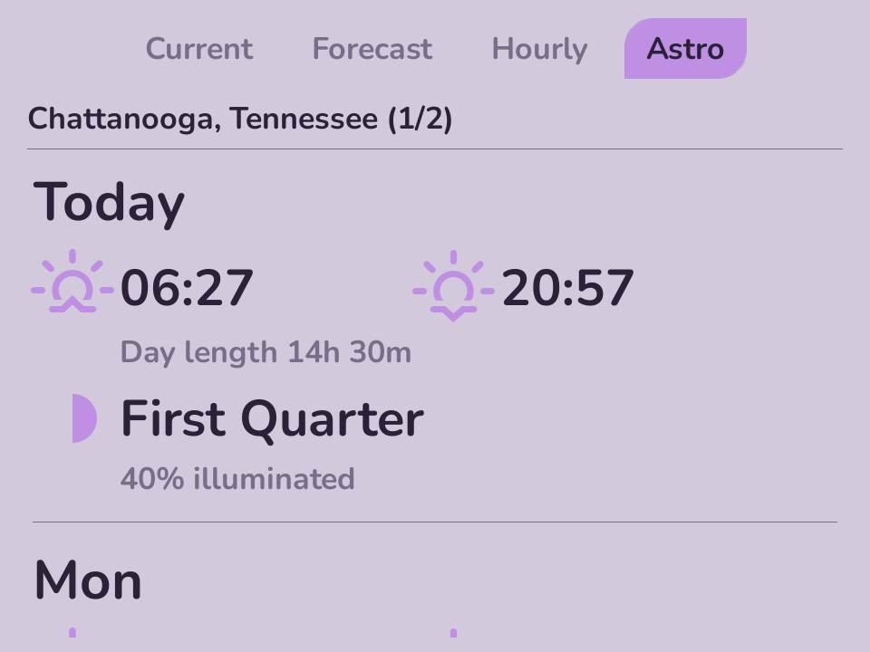

<div align="center">



# Nimbus

**A big, glanceable weather app for [Leaf](https://leaf.game) on the Miniloong Pocket 1.**

[](LICENSE)
[](https://github.com/Utility-Muffin-Research-Kitchen/Nimbus/releases/latest)
[](https://github.com/Utility-Muffin-Research-Kitchen/Nimbus/releases)


</div>

Nimbus shows current conditions, a 3-day forecast, an hourly timeline, and sun &
moon details — built for a screen you glance at mid-session, with oversized type
and bold weather glyphs that match your Leaf color scheme.

It's the **Leaf / Miniloong Pocket 1** port of the original
[NextUI Nimbus](https://github.com/ericreinsmidt/nextui-nimbus): rebuilt
[Catastrophe](https://github.com/Utility-Muffin-Research-Kitchen)-native and moved
to [Open-Meteo](https://open-meteo.com) for weather, so it needs **no account and
no API key**. It just works on first launch.

## Screenshots

<div align="center">

| Current | Forecast | Hourly | Astro |
|:---:|:---:|:---:|:---:|
|  |  |  |  |

</div>

## Features

- **Four views** — Current, Forecast (3-day), Hourly, and Astro (sun & moon).
  Switch with **L1 / R1**.
- **Big and glanceable** — a large weather glyph beside a huge temperature, then
  the stats that matter: humidity, wind, UV, air quality, and a details line for
  gusts, pressure, and dew point. Designed for the handheld, not shrunk down from
  a phone.
- **Theme-native** — inherits your Leaf color scheme, font, and selection-pill
  style; glyphs pick up the theme's accent.
- **Multiple locations** — search by city or postal code, or auto-locate by IP.
  Flip between saved places with **left / right**.
- **Instant + fresh** — shows your last-known weather immediately and refreshes in
  the background, so it never blocks on the network.
- **No setup** — keyless weather, works offline from cache, with °F / °C and
  12 / 24-hour options.

## Install

Nimbus is a standalone Leaf app. From the
[latest release](https://github.com/Utility-Muffin-Research-Kitchen/Nimbus/releases/latest),
download `Nimbus.pak.zip`, unzip it, and copy the `Nimbus.pak` folder into
`Apps/mlp1/` on your Leaf SD card. It then appears under **Apps → Nimbus**.

## Build

```sh
# Desktop dev build (sibling ../Catastrophe + Homebrew SDL2 + libcurl)
make native && make run-native

# Device build — aarch64 via the Leaf Docker toolchain -> build/mlp1/package/Nimbus.pak
make package-mlp1
```

The app icon is regenerated from source assets with
[`scripts/make-icon.py`](scripts/make-icon.py).

## How it works

- Forecast and geocoding come from **[Open-Meteo](https://open-meteo.com)** (keyless),
  fetched with libcurl and parsed with vendored cJSON.
- "Auto-locate" resolves your city from your IP via
  [ip-api.com](https://ip-api.com); moon phase is computed locally.
- Fetches run on a background thread; the UI renders cached data and swaps in the
  fresh result when it arrives.

## Credits

- UI: **[Catastrophe](https://github.com/Utility-Muffin-Research-Kitchen)** (Leaf's toolkit)
- Weather data: **[Open-Meteo](https://open-meteo.com)** (CC-BY 4.0)
- Weather glyphs: **[Weather Icons](https://github.com/erikflowers/weather-icons)** by Erik Flowers (SIL OFL 1.1)
- Icon wordmark: **[Nunito](https://github.com/googlefonts/nunito)** (SIL OFL 1.1)

## License

MIT — see [LICENSE](LICENSE). © Eric Reinsmidt.
